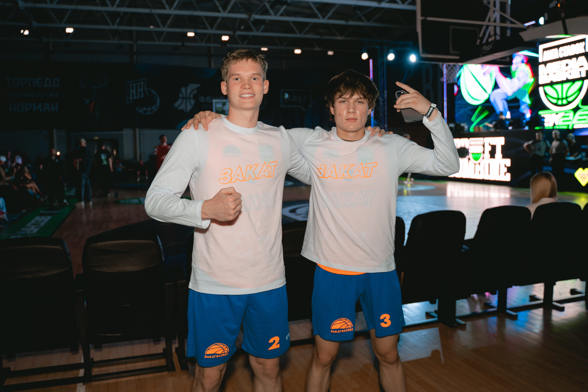
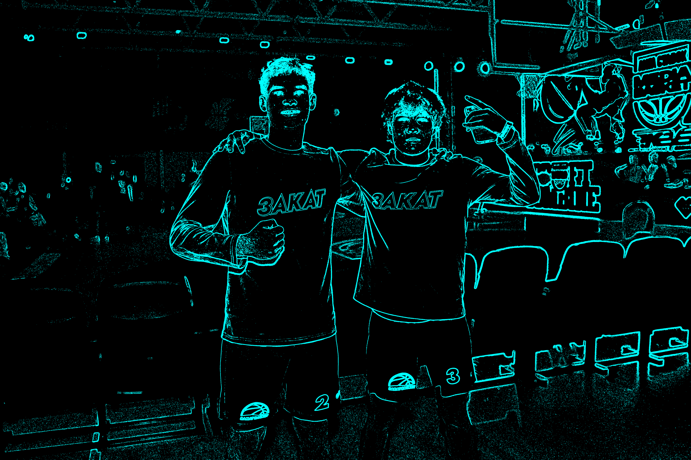

# Практическая работа № 1. Фильтры изображений

## Файлы

- `main.py` — разбор аргументов, чтение файла, запуск фильтра и сохранение результата;
- `filters.py` — базовый класс `ImageFilter`, вспомогательные функции и фильтры;
- `images/` — исходные изображения и примеры результатов;
- `requirements.txt` — зависимости проекта.

## Установка

```bash
cd GalkinDA/1_ImageProcessing
python3 -m venv .venv
source .venv/bin/activate
pip install -r requirements.txt
```

## Запуск

Общий вид команды:

```bash
python3 main.py ВХОДНОЙ_ФАЙЛ ВЫХОДНОЙ_ФАЙЛ --filter ИМЯ_ФИЛЬТРА [параметры]
```

### Фильтры и параметры

| Имя фильтра | Назначение | Параметры |
| --- | --- | --- |
| `resize` | Изменение размера | `--new-h`, `--new-w` — новая высота и ширина, целые числа больше нуля, обязательны |
| `gray` | Перевод в оттенки серого | нет |
| `antique` | Сепия | нет |
| `fade` | Смешивание с блеклым цветом | `--alpha` от 0 до 1, по умолчанию `0.5`; `--fade-color R G B` — целые значения от 0 до 255, по умолчанию `200 200 200` |
| `film` | Цветовая имитация плёнки с зерном | `--grain-sigma` не меньше нуля, по умолчанию `10`; `--seed` |
| `matte` | Белая овальная виньетка | нет |
| `scratches` | Состаривание: шум и светлые царапины | `--noise-sigma` не меньше нуля, по умолчанию `15`; `--num-scratches` — целое число не меньше нуля, по умолчанию `7`; `--seed` |
| `neon` | Контуры с голубым свечением | `--sob-threshold` не меньше нуля, по умолчанию `50` |

Для `film` и `scratches` параметр `--seed` задаёт неотрицательное целое число.
При одинаковых изображении, параметрах и `seed` результат повторяется.
Если `seed` не указан, шум и царапины генерируются заново при каждом запуске.

Примеры всех команд:

```bash
python3 main.py images/mediabasket.jpg images/resize.png --filter resize --new-h 1200 --new-w 1800
python3 main.py images/mediabasket.jpg images/gray.png --filter gray
python3 main.py images/mediabasket.jpg images/antique.png --filter antique
python3 main.py images/mediabasket.jpg images/fade.png --filter fade --alpha 0.4 --fade-color 200 200 200
python3 main.py images/mediabasket.jpg images/film.png --filter film --grain-sigma 10 --seed 10
python3 main.py images/mediabasket.jpg images/matte.png --filter matte
python3 main.py images/mediabasket.jpg images/scratches.png --filter scratches --noise-sigma 15 --num-scratches 7 --seed 10
python3 main.py images/mediabasket.jpg images/neon.png --filter neon --sob-threshold 50
```

## Описание алгоритмов

Изображение представлено массивом `uint8` формы `(H, W, 3)` с каналами RGB,
где `H` — высота, `W` — ширина; `x` обозначает столбец, `y` — строку.
CLI принимает RGB-изображения. Результат `gray` имеет форму `(H, W)`.
Обработка выполняется операциями NumPy, Pillow используется только для чтения и сохранения.

Вычисления с яркостью выполняются в вещественных числах. Перед возвратом результата
значения ограничиваются диапазоном `0..255` и переводятся в `uint8`;
Resize сразу копирует исходные значения. `clip(a, low, high)` ограничивает `a`
указанным диапазоном. В записи шума `N(0, sigma^2)` ноль — среднее,
`sigma` — стандартное отклонение, `sigma^2` — дисперсия.

### 1. Resize

Размер изображения изменяется методом ближайшего соседа. Для каждого пикселя
результата с координатами `(y, x)` выбирается пиксель исходного изображения:

```text
old_y = floor(y * H / new_h)
old_x = floor(x * W / new_w)
result[y, x] = img[old_y, old_x]
```

`floor` округляет координаты вниз, индексы ограничиваются границами изображения.
Новые значения цвета не вычисляются: при увеличении пиксели повторяются,
при уменьшении часть исходных пикселей пропускается.

### 2. RGB2GrayScale

Для RGB-пикселя вычисляется компонента яркости Y из цветового пространства YUV:

```text
Y = 0.299R + 0.587G + 0.114B
```

Три цветовых канала заменяются одним значением яркости. Наибольший вес имеет
зелёный канал, наименьший — синий.

### 3. Antique

Эффект сепии задаётся матрицей преобразования цвета. Для каждого пикселя:

```text
|R'|   |0.393 0.769 0.189| |R|
|G'| = |0.349 0.686 0.168| |G|
|B'|   |0.272 0.534 0.131| |B|
```

Матрица применяется ко всем пикселям и придаёт изображению тёплый коричневый оттенок.
В коде RGB-векторы записаны строками, поэтому используется транспонированная матрица.

### 4. Fade Color

Изображение смешивается с выбранным RGB-цветом `fade_color`:

```text
result = (1 - alpha) * img + alpha * fade_color
```

При `alpha = 0` сохраняется исходное изображение, при `alpha = 1` получается
сплошная заливка выбранным цветом. Промежуточные значения дают плавное выцветание.

### 5. Film

Цветовой плёночный эффект создаётся линейным преобразованием RGB-каналов:

```text
R' = 2G - B
G' = R
B' = 2B - G
```

Такое преобразование меняет цветовые соотношения: зелёные участки получают
красный оттенок. К преобразованному изображению добавляется зерно:

```text
epsilon ~ N(0, grain_sigma^2)
result = clip([R', G', B'], 0, 255) + epsilon
```

Шум независим для каждого пикселя и канала. Это стилизация под цветную плёнку,
а не точная модель.

### 6. Matte

Строится эллипс с центром изображения и полуосями `rx`, `ry`.
Для каждого пикселя вычисляется нормированное расстояние `d` до центра:

```text
cx = (W - 1) / 2, cy = (H - 1) / 2
rx = max(cx, 0.5), ry = max(cy, 0.5)
d = sqrt(((x - cx) / rx)^2 + ((y - cy) / ry)^2)
w = clip((1 - d) / 0.5, 0, 1)
```

Минимальная полуось `0.5` исключает деление на ноль для изображения шириной
или высотой в один пиксель. Маска смешивает изображение с белым фоном:

```text
result = w * img + (1 - w) * 255
```

При `d <= 0.5` исходное изображение сохраняется. При `0.5 < d < 1` оно плавно
осветляется, а при `d >= 1` заменяется белым цветом.

### 7. ScratchesNoise

Сначала к изображению добавляется гауссов шум:

```text
epsilon ~ N(0, noise_sigma^2)
result = img + epsilon
```

Для каждой царапины выбираются случайные концы отрезка и толщина в один или два
пикселя. Координаты вдоль отрезка вычисляются по формулам:

```text
x(t) = x0 + t * (x1 - x0)
y(t) = y0 + t * (y1 - y0),  0 <= t <= 1
```

Координаты округляются до целых, а пиксели царапин закрашиваются белым (`255`).
Точки линии рассчитываются массивами; цикл выполняется только по числу царапин.

### 8. Neon

Сначала вычисляется серое изображение по формуле из раздела 2. Далее применяется
линейная фильтрация с дублированием крайних пикселей:

```text
I'(x, y) = sum_i sum_j F(i, j) * I(x + i, y + j)
```

Ядро применяется без отражения. Смещение `i` идёт по
столбцам, `j` — по строкам. Контуры определяются двумя ядрами Собеля:

```text
Kx = [-1  0  1]     Ky = [-1 -2 -1]
     [-2  0  2]          [ 0  0  0]
     [-1  0  1]          [ 1  2  1]
```

`Kx` выделяет изменения яркости по горизонтали, `Ky` — по вертикали.
Из результатов фильтрации `Gx` и `Gy` вычисляется величина градиента:

```text
G = sqrt(Gx^2 + Gy^2)
edges = 1, если G > sob_threshold, иначе 0
```

Для свечения маска контуров усредняется ядром `ones(5, 5) / 25`:

```text
glow = convolve(edges, ones(5, 5) / 25)
strength = clip(edges + 2 * glow, 0, 1)
result = strength * [0, 255, 255]
```

Результат — голубые контуры и мягкое свечение на чёрном фоне.

## Пример результата

Исходное изображение и результат неонового эффекта хранятся в `images/`.

| До | После: `neon` |
| --- | --- |
|  |  |
