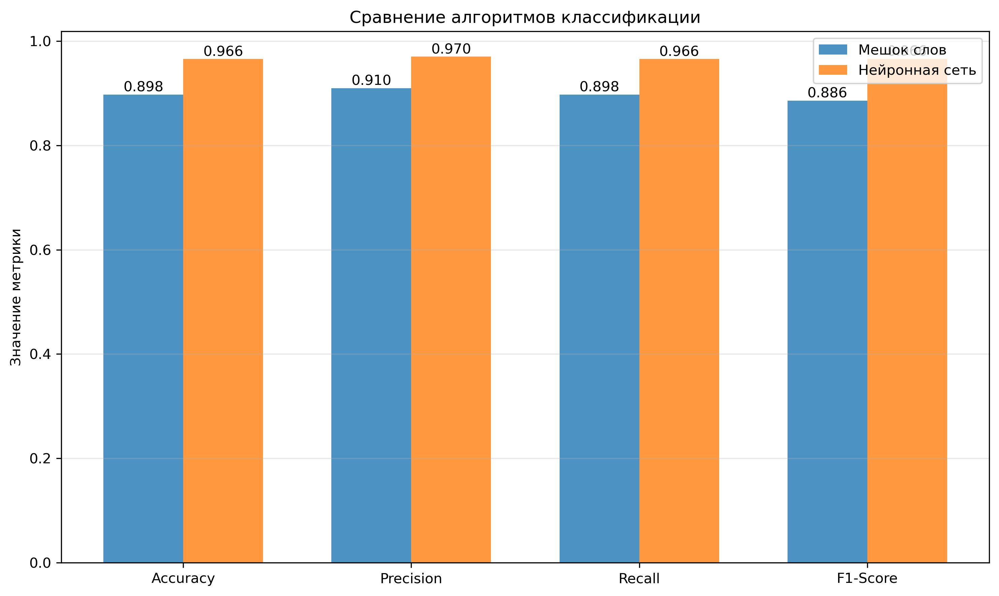
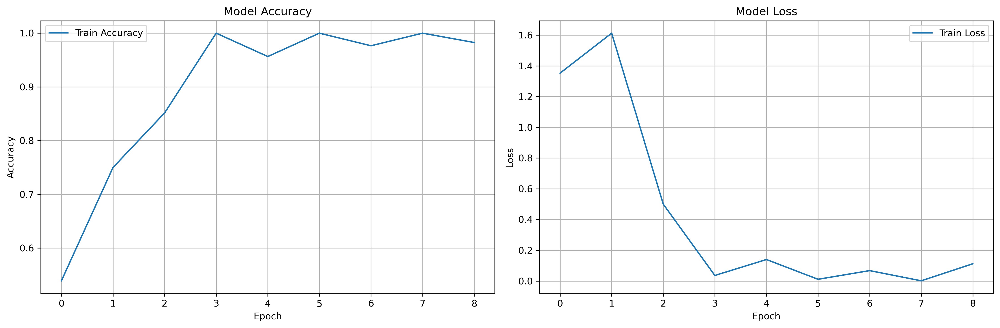
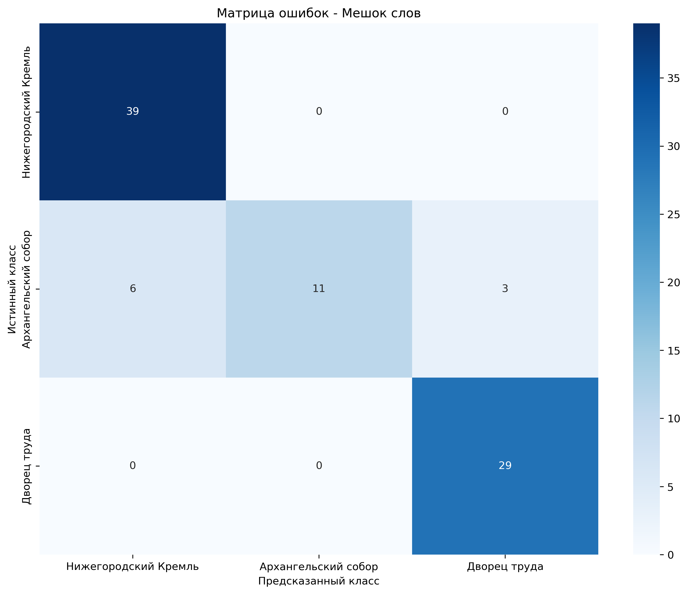
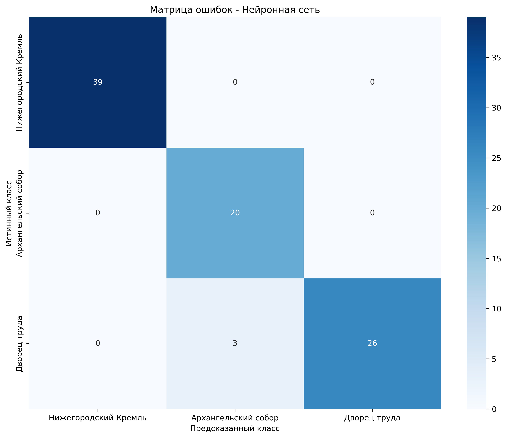

# Практическая работа №3. Классификация изображений с использованием библиотеки OpenCV

## Описание задачи

Разработано приложение для классификации изображений известных достопримечательностей Нижнего Новгорода:
- **Нижегородский Кремль** (01_NizhnyNovgorodKremlin)
- **Архангельский собор** (04_ArkhangelskCathedral)
- **Дворец труда** (08_PalaceOfLabor)

Скачайте [набор данных](https://cloud.unn.ru/s/2KsWFmaxzZf9mF5/download/NNClassification.zip) и разархивируеть в `lab3/`. Набор содержит фотографии студентов ИИТММ (директория `NNSUDataset`) и фотографии, выгруженные из сети Интернет (директория `ExtDataset`).

Скачайте [перечень изображений тренировочной выборки](https://cloud.unn.ru/s/5rakAsHxweBi6qD) и поместите его в `lab3/`. Изображения, не входящие в перечень попадают в тестовую выборку.

## Реализованные алгоритмы

### 1. Алгоритм мешок слов (Bag of Words)

Алгоритм основан на извлечении локальных признаков из изображений и построении словаря визуальных слов.

#### Этапы работы:

1. **Извлечение признаков**:
   - Использование детекторов и дескрипторов ключевых точек (SIFT, SURF или ORB)
   - Для каждого изображения извлекаются дескрипторы, описывающие локальные особенности

2. **Построение словаря визуальных слов**:
   - Все дескрипторы из тренировочных изображений объединяются
   - Применяется алгоритм кластеризации K-means для создания словаря из заданного количества слов (по умолчанию 300)
   - Каждый кластер представляет собой "визуальное слово"

3. **Создание гистограмм**:
   - Для каждого изображения создается гистограмма частоты встречаемости визуальных слов
   - Каждый дескриптор изображения сопоставляется с ближайшим центроидом словаря
   - Гистограмма нормализуется

4. **Классификация**:
   - Использование SVM (Support Vector Machine) классификатора с RBF ядром
   - Обучение на гистограммах тренировочных изображений
   - Предсказание классов для тестовых изображений

#### Преимущества:
- Не требует больших вычислительных ресурсов
- Хорошо работает на небольших наборах данных
- Интерпретируемость результатов

### 2. Нейросетевой классификатор

Реализован классификатор на основе архитектуры ResNet50 с использованием техники transfer learning.

#### Архитектура модели:

1. **Базовая модель ResNet50**:
   - Использованы предобученные веса на датасете ImageNet
   - Базовые слои заморожены для сохранения предобученных признаков
   - Извлечение признаков высокого уровня из изображений

2. **Добавленные слои**:
   - Global Average Pooling - усреднение пространственных признаков
   - Полносвязный слой (512 нейронов) с активацией ReLU
   - Dropout (0.5) для регуляризации
   - Полносвязный слой (256 нейронов) с активацией ReLU
   - Dropout (0.3) для регуляризации
   - Выходной слой (3 нейрона) с активацией softmax для классификации

3. **Обучение**:
   - Оптимизатор: Adam с начальной скоростью обучения 0.001
   - Функция потерь: sparse_categorical_crossentropy
   - Аугментация данных: поворот, сдвиг, отражение, масштабирование
   - Callbacks: ModelCheckpoint, EarlyStopping, ReduceLROnPlateau

#### Преимущества:
- Высокая точность классификации
- Автоматическое извлечение признаков
- Устойчивость к вариациям изображений

## Структура проекта

```
lab3/
├── dataset_loader.py      # Загрузка и предобработка данных
├── bow_classifier.py      # Реализация алгоритма мешок слов
├── nn_classifier.py       # Реализация нейросетевого классификатора
├── utils.py              # Вспомогательные функции
├── main.py               # Главный скрипт с CLI интерфейсом
├── requirements.txt      # Зависимости проекта
├── README.md             # Документация
├── train.txt            # Список тренировочных изображений
├── NNClassification/    # Директория с данными
|    ├── ExtDataset/      # Внешние изображения
|    └── NNSUDataset/     # Изображения студентов
├── models/                # Папка с моделями (после первого запуска) 
└── results/               # Папка с результатами (после первого запуска)
```

## Установка зависимостей

```bash
pip install -r requirements.txt
```

## Использование

### Основные параметры командной строки:

- `--data_dir` - путь к директории с данными (по умолчанию: `NNClassification`)
- `--train_file` - путь к файлу train.txt (по умолчанию: `train.txt`)
- `--mode` - режим работы: `train`, `test`, `both` (по умолчанию: `both`)
- `--algorithm` - алгоритм: `bow`, `nn`, `both` (по умолчанию: `both`)

### Параметры для алгоритма мешок слов:

- `--bow_vocab_size` - размер словаря (по умолчанию: 300)
- `--bow_detector` - детектор: `sift`, `surf`, `orb` (по умолчанию: `sift`)
- `--bow_model_path` - путь для сохранения/загрузки модели (по умолчанию: `models/bow_model.pkl`)

### Параметры для нейросети:

- `--nn_epochs` - количество эпох (по умолчанию: 20)
- `--nn_batch_size` - размер батча (по умолчанию: 16)
- `--nn_model_path` - путь для сохранения/загрузки модели (по умолчанию: `models/nn_model.h5`)
- `--model_save_dir` - директория для сохранения моделей (по умолчанию: `models`)
- `--results_dir` - директория для сохранения результатов (по умолчанию: `results`)

### Примеры использования:

1. **Обучение и тестирование обоих алгоритмов:**
```bash
python main.py --mode both --algorithm both # создание гистограмм может занять много времени, зависит от устройства
```

2. **Только обучение алгоритма мешок слов:**
```bash
python main.py --mode train --algorithm bow  --bow_detector orb
```

3. **Только тестирование нейросети:**
```bash
python main.py --mode test --algorithm nn --nn_model_path models/nn_model.h5
```

4. **Обучение нейросети с кастомными параметрами:**
```bash
python main.py --mode train --algorithm nn --nn_epochs 30 --nn_batch_size 32
```

## Результаты

После выполнения скрипта результаты сохраняются в директории `results/`.

### Сравнение алгоритмов и история обучения

<table>
  <tr>
    <td></td>
    <td></td>
  </tr>
  <tr>
    <td align="center"><b>Сравнение метрик алгоритмов</b></td>
    <td align="center"><b>История обучения нейросети</b></td>
  </tr>
</table>

### Матрицы ошибок

<table>
  <tr>
    <td></td>
    <td></td>
  </tr>
  <tr>
    <td align="center"><b>Мешок слов (BoW)</b></td>
    <td align="center"><b>Нейронная сеть (ResNet50)</b></td>
  </tr>
</table>

### Численные результаты

#### Алгоритм мешок слов (Bag of Words)

| Метрика | Значение |
|---------|----------|
| Accuracy | 0.8977 |
| Precision | 0.9100 |
| Recall | 0.8977 |
| F1-Score | 0.8862 |

**Матрица ошибок:**

```
                    Предсказанный класс
                    Кремль  Собор  Дворец
Истинный   Кремль  [  39      0      0  ]
класс      Собор   [   6     11      3  ]
           Дворец  [   0      0     29  ]
```

#### Нейросетевой классификатор (ResNet50)

| Метрика | Значение |
|---------|----------|
| Accuracy | 0.9659 |
| Precision | 0.9704 |
| Recall | 0.9659 |
| F1-Score | 0.9662 |

**Матрица ошибок:**
```
                    Предсказанный класс
                    Кремль  Собор  Дворец
Истинный   Кремль  [  39      0      0  ]
класс      Собор   [   0     20      0  ]
           Дворец  [   0      3     26  ]
```

### Выводы по результатам

| Алгоритм | Accuracy | Precision | Recall | F1-Score |
|----------|----------|-----------|--------|----------|
| Мешок слов | 89.77% | 91.00% | 89.77% | 88.62% |
| Нейронная сеть | 96.59% | 97.04% | 96.59% | 96.62% |

Нейросетевой классификатор показал лучшие результаты по всем метрикам, превосходя алгоритм мешок слов по всем показателям

### Сохранённые файлы

Модели сохраняются в директории `models/`:
- `bow_model.pkl` - модель алгоритма мешок слов
- `nn_model.h5` - модель нейросети
- `best_resnet50_model.h5` - модель ResNet50 (скачивается при первом запуске)

## Метрики оценки

Для каждого алгоритма вычисляются следующие метрики:

- **Accuracy** - общая точность классификации
- **Precision** - точность (weighted average)
- **Recall** - полнота (weighted average)
- **F1-Score** - гармоническое среднее precision и recall
- **Confusion Matrix** - матрица ошибок для детального анализа

## Технические подробности

### Алгоритм мешок слов:
- Детектор/дескриптор: SIFT (по умолчанию), SURF или ORB (рекомендуется при долгих вычислениях)
- Размер словаря: 300
- Классификатор: SVM
- Нормализация признаков: StandardScaler

### Нейросетевой классификатор:
- Базовая архитектура: ResNet50
- Предобученные веса: ImageNet
- Размер входных изображений: 224x224
- Аугментация данных включена при обучении

## Зависимости

- opencv-python >= 4.8.0
- numpy >= 1.24.0
- scikit-learn >= 1.3.0
- tensorflow >= 2.13.0
- matplotlib >= 3.7.0
- pandas >= 2.0.0
- seaborn >= 0.12.0

## Примечания

- Для использования SURF детектора требуется компиляция OpenCV с флагом `OPENCV_ENABLE_NONFREE`
- При первом запуске нейросети будут загружены предобученные веса ResNet50 (~100 МБ)
- Обучение нейросети может занять значительное время в зависимости от размера датасета и параметров
- Рекомендуется использовать GPU для ускорения обучения нейросети

